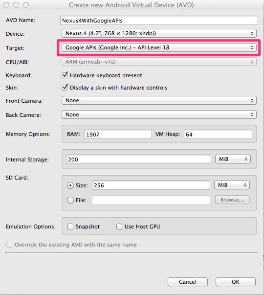
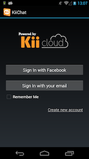
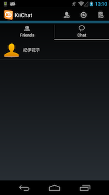
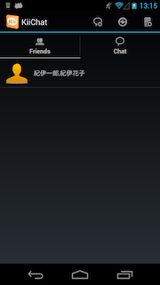
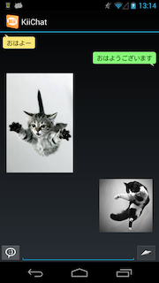

#KiiChat
KiiChat is simple chat application using the [KiiCloud](https://developer.kii.com/?locale=en).  
This demo project helps you learn how to use the KiiCloud.

##Requirements:
- Android Studio

##How to setup a project:

1. Go to [developer console](https://developer.kii.com) and create account/ app.
2. Replace APP_ID, APP_KEY, APP_SITE in ApplicationConst.java with yours created in step 1.

### Setup Push Notification
Please read this [guide][push-guide] and Setup GCM for you app.
Replace the SENDER_ID in ApplicationConst.java with yours.

[push-guide]:http://docs.kii.com/en/guides/android/quickstart/adding-kii-push-notification-to-your-application/adding-push-notification-gcm

In order to test push notification on emulater, please check following steps.

1. Make sure you are using emulator targetted on Google API
1. Add account on emulator as setting->account

### Setup Facebook integration
Please read this [guide][fb-guide] and configure Facebook appID/ appSecret in developer console.

[fb-guide]:http://docs.kii.com/en/guides/android/managing-users/social-network-integration/facebook

### Setup Analytics
Please read this [guide][analytics-guide] and replace AGGREGATION_RULE_ID in ApplicationConst.java with yours.

[analytics-guide]:http://documentation.kii.com/en/guides/android/managing-analytics/flex-analytics/analyze-event-data

##Kii Features used:

- User Management
	- Sign Up
	- Sign In
	- Integrating Facebook Account
- Group Management
	- Creating Groups
	- Adding Group Members
	- Listing Groups
- Data Management
	- Setting ACL to a Bucket
	- Creating/Retrieving Objects
	- Querying for Objects
	- Uploading Object Bodies
	- Downloading Object Bodies
	- Receiving "Push to App" Notifications
- Push Notifications
	- "Push to User" Notifications
	- "Push to App" Notifications
- Analytics
	- Event data analytics

##Support:
If you have any questions, please feel free to ask at [community](http://community.kii.com/).

##Screenshots:

<table border="0">
  <tr>
    <td></td>
    <td></td>
  </tr>
  <tr>
    <td></td>
    <td></td>
  </tr>
</talbe>

